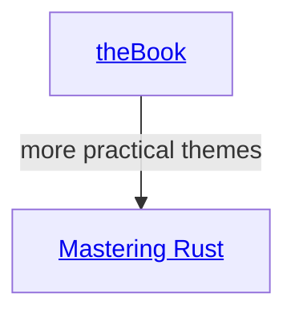

#  the Rust books graph
## #Rust learning tree plan over existing/planned books
#Rust #rbg #bib

(by) Dmitry Ponyatov <dponyatov@gmail.com> 2021 MIT

github: https://github.com/ponyatov/rbg

## Diagramming: `mermaid`
- https://gist.github.com/blackcater/1701e845a963216541591106c1bb9d3b

